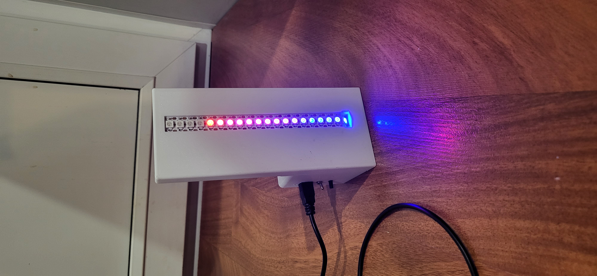
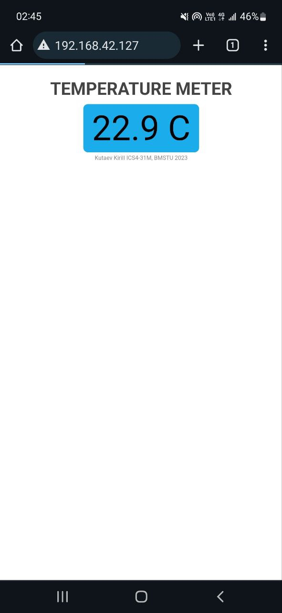

# temperature-meter

# Device



# Demo

Link to a video demonstration of the device's functionality
[Video](https://drive.google.com/file/d/12vUG7TxpgPC9e38MXSXuw1ZNHgoio4qw/view?usp=drive_link)



# ESP Settings

Initial
```text
AT+RST
AT+CWMODE=1
AT+CWJAP= “Wi-FiNetwork”,“Password”
AT+CIFSR
AT+CIPMUX=1
```

Start server
```text
AT+CIPSERVER=1,80
```

Reply to client
```text
AT+CIPSEND=0,5
hello
AT+CIPCLOSE=0
```